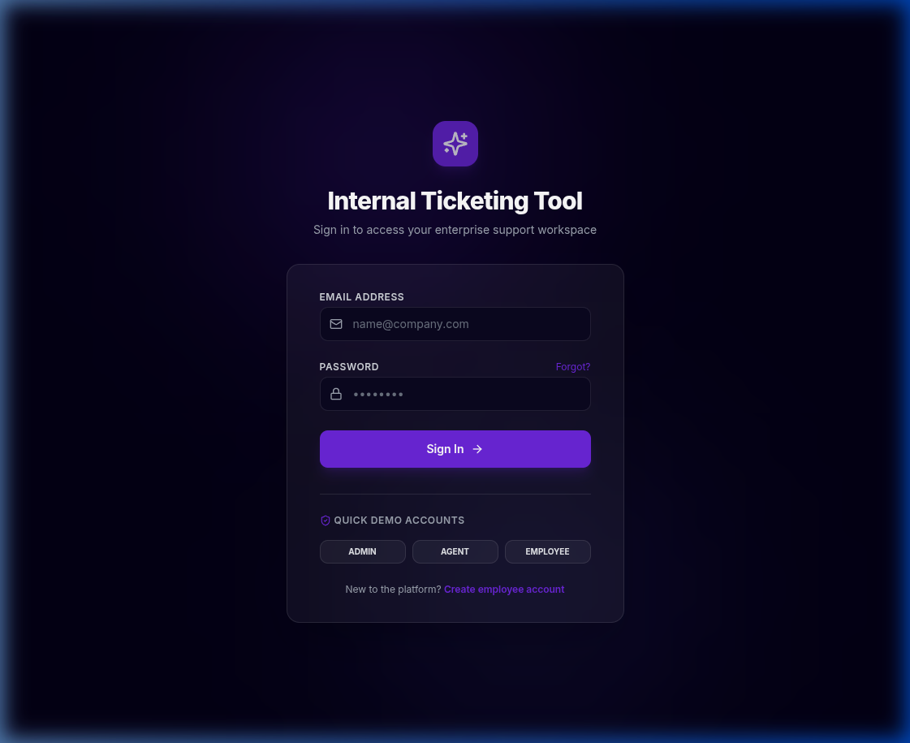
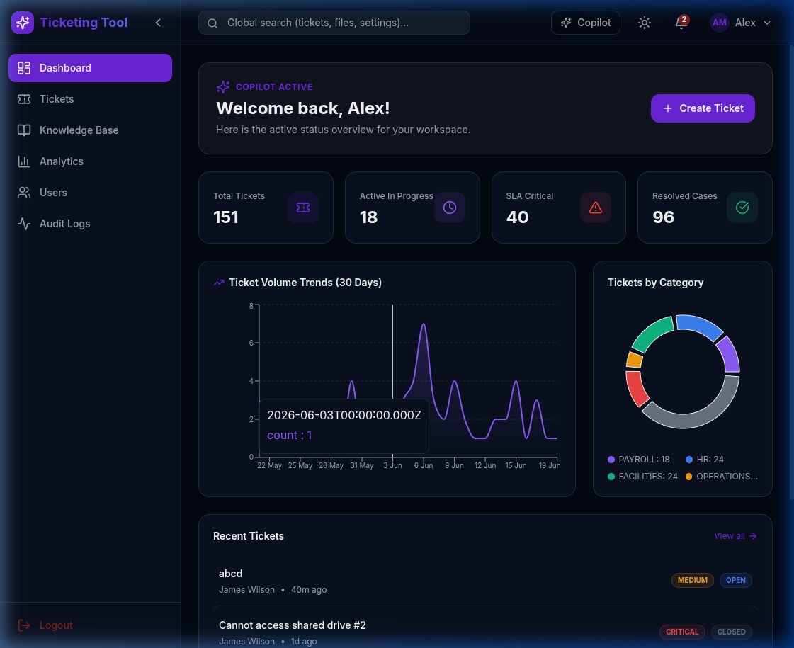
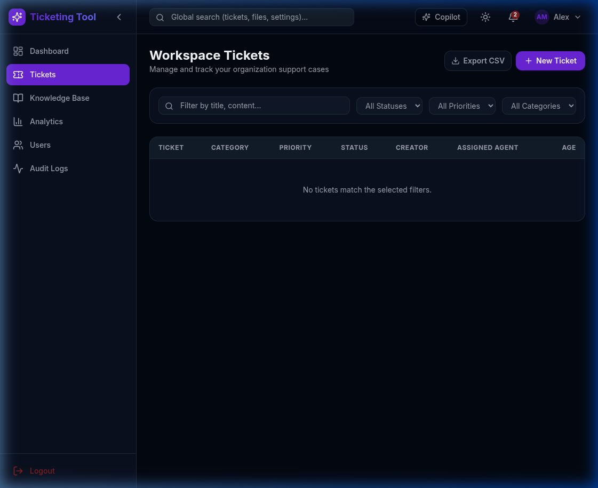
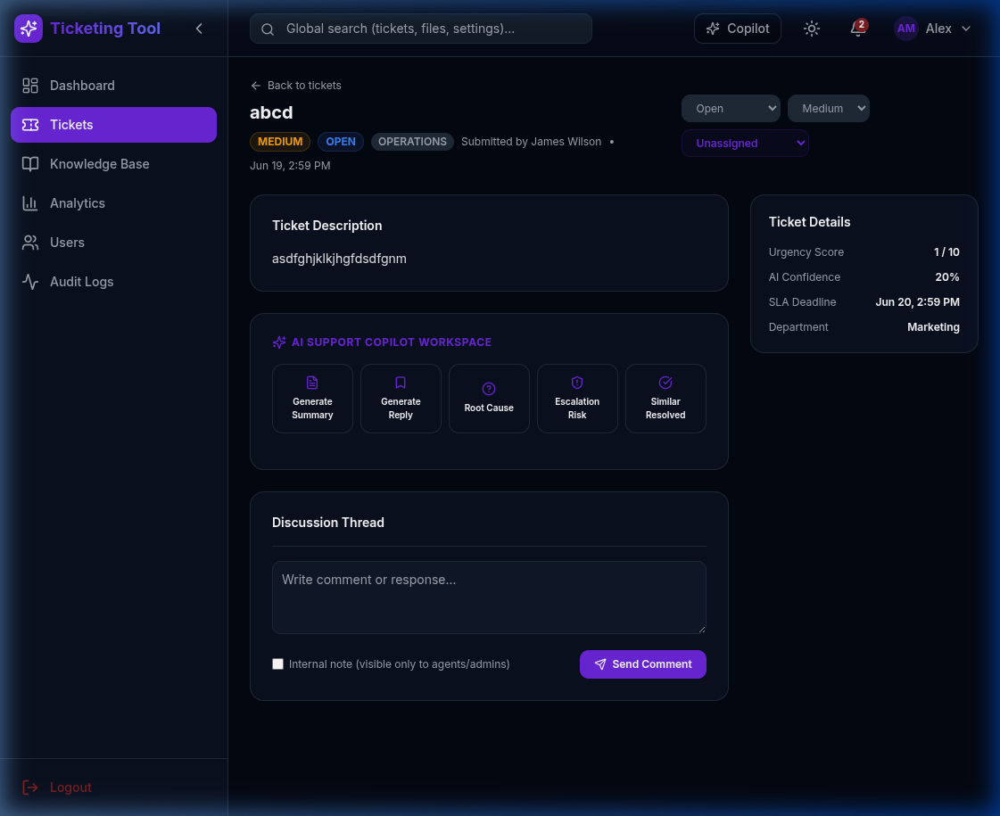

# Internal Ticketing Tool

An enterprise-grade internal support ticketing platform designed to streamline employee requests across departments (IT, HR, Finance, and Facilities). The application features a full ticket lifecycle management system, a comprehensive analytics dashboard, and an advanced AI layer to assist agents with faster resolutions.

## Features

### Core Ticketing System
- **Multi-Department Routing:** Employees can raise tickets directed to specific departments (IT, HR, Payroll, Facilities, Security, Operations).
- **Full Ticket Lifecycle:** Track tickets from Open to In Progress, Waiting, Resolved, and Closed.
- **Role-Based Access Control:** Distinct interfaces and permissions for Admins, Agents, and Employees.
- **Real-Time Notifications:** In-app notifications alert users when their ticket status changes or new comments are added.

### AI Integration Layer
- **Auto-Categorization:** Uses LLMs to automatically determine the correct category and urgency level from an employee's ticket description.
- **Similar Ticket Matching:** Leverages a PostgreSQL vector database (`pgvector`) to mathematically compare embeddings and surface previously resolved tickets that match the current issue.
- **Auto-Draft Responses:** Agents can utilize the AI Copilot to read the ticket context and instantly draft a professional, context-aware reply.
- **RAG Knowledge Base:** Employees can upload internal policy documents. The AI chunks and embeds the documents, allowing users to ask questions and get answers directly sourced from company documentation.
- **Root Cause Analysis & Summarization:** Single-click tools for agents to extract the core issue and generate concise summaries of long ticket threads.

### Built-in Analytics
- **Executive Dashboard:** Visualizes total ticket volume, average resolution times, SLA compliance rates, and category distribution.

## Architecture

- **Frontend:** React, TypeScript, Tailwind CSS, Radix UI, Zustand (State Management), Vite.
- **Backend:** Node.js, Express, TypeScript, Prisma ORM, PostgreSQL.
- **AI/ML:** Groq API (LLaMA 3) for text generation, semantic hash-based pseudo-embeddings, pgvector for vector similarity search.
- **Deployment:** Fully containerized with Docker and Docker Compose, served behind an Nginx reverse proxy.

## Screenshots

### Login Page


### Analytics Dashboard


### Ticket Management Queue


### AI Copilot & Ticket Details


## Local Development & Setup

### Prerequisites
- Docker and Docker Compose
- Groq API Key

### Getting Started

1. Clone the repository:
   ```bash
   git clone https://github.com/SrujanKashyapS/internal-ticketing-tool.git
   cd internal-ticketing-tool
   ```

2. Configure environment variables:
   Copy the example environment file and add your Groq API key and preferred secrets.
   ```bash
   cp .env.example .env
   ```

3. Start the application using Docker:
   ```bash
   docker compose up -d
   ```
   *Note: This will automatically build the React frontend, compile the Node.js backend, initialize the PostgreSQL database, run the Prisma schema push, and execute the database seed script.*

4. Access the application:
   Open your browser and navigate to `http://localhost`.

### Demo Accounts
The database seed script automatically provisions the following test accounts (Password for all is `password123`):
- **Admin:** admin@copilot.dev
- **Agent:** agent1@copilot.dev
- **Employee:** emp1@copilot.dev

## Database Reset
If you need to wipe the database and re-run the seed script:
```bash
docker compose down -v
docker compose up -d
```
